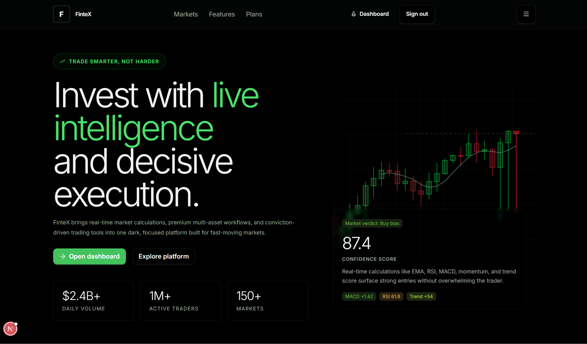
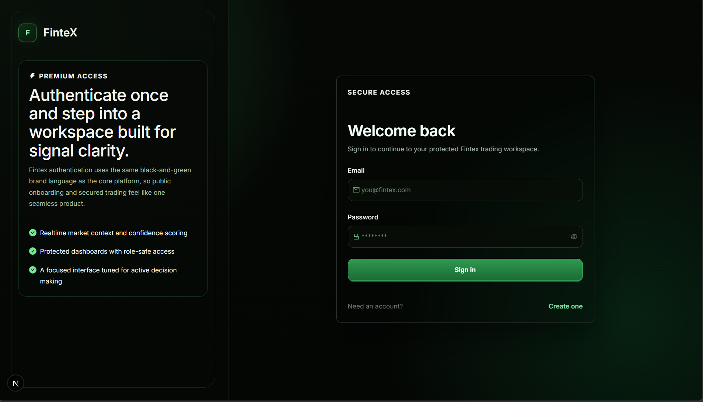
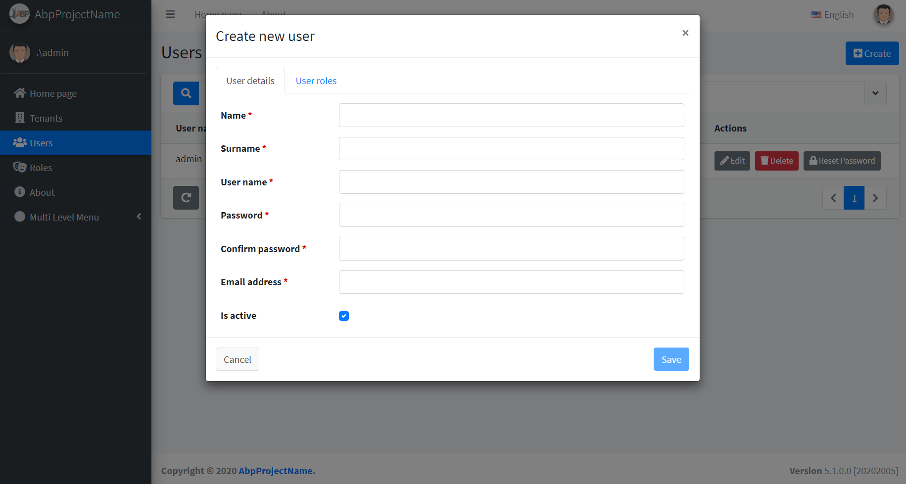

# Fintex

Fintex is an academy-first trading workspace that combines structured onboarding, live market intelligence, paper trading, AI-assisted decision support, automation, goals, notifications, and broker connectivity into one product.

This repository contains the full stack:

- a **Next.js frontend** in [`Frontend/nextjs`](Frontend/nextjs)
- an **ASP.NET Core + ABP backend** in [`Backend/aspnet-core`](Backend/aspnet-core)

The project is opinionated around a very specific user journey:

1. create an account
2. complete the in-app academy
3. practice and grow in paper trading
4. unlock deeper product access
5. optionally connect a live external broker
6. use realtime verdicts, news, macro context, AI analysis, automations, and goals to guide execution

This README is intentionally exhaustive. It is designed to be the main technical and product reference for the repository.

Domain Model: https://drive.google.com/file/d/1bY37iGFGhMYyN-WLzoLy-kBOuDzqLFCG/view?usp=sharing
Figma: https://www.figma.com/design/97l0hfe6ogeRn0mjbfe4Gy/Untitled?node-id=0-1&t=WBQRCyiSmq0Lw9oz-1

---

## Table of Contents

- [1. Product Summary](#1-product-summary)
- [2. What Fintex Actually Does](#2-what-fintex-actually-does)
- [3. Core Product Pillars](#3-core-product-pillars)
- [4. End-to-End User Journey](#4-end-to-end-user-journey)
- [5. Screenshots](#5-screenshots)
- [6. Repository Layout](#6-repository-layout)
- [7. Technology Stack](#7-technology-stack)
- [8. Frontend Deep Dive](#8-frontend-deep-dive)
- [9. Backend Deep Dive](#9-backend-deep-dive)
- [10. Major Features](#10-major-features)
- [11. Realtime Market Data and Verdict Pipeline](#11-realtime-market-data-and-verdict-pipeline)
- [12. Paper Trading Lifecycle](#12-paper-trading-lifecycle)
- [13. External Broker Lifecycle](#13-external-broker-lifecycle)
- [14. Automation and Goal Engine](#14-automation-and-goal-engine)
- [15. AI and Intelligence Features](#15-ai-and-intelligence-features)
- [16. API and Realtime Surface](#16-api-and-realtime-surface)
- [17. Configuration and Environment Variables](#17-configuration-and-environment-variables)
- [18. Local Development Setup](#18-local-development-setup)
- [19. Build, Test, and Quality Checks](#19-build-test-and-quality-checks)
- [20. Deployment Overview](#20-deployment-overview)
- [21. Azure Runtime Configuration](#21-azure-runtime-configuration)
- [22. Vercel Runtime Configuration](#22-vercel-runtime-configuration)
- [23. CI/CD Notes](#23-cicd-notes)
- [24. Troubleshooting Guide](#24-troubleshooting-guide)
- [25. Known Constraints and Design Tradeoffs](#25-known-constraints-and-design-tradeoffs)
- [26. Extension Opportunities](#26-extension-opportunities)
- [27. License](#27-license)

---

## 1. Product Summary

Fintex is not only a price dashboard and not only a trading simulator.

It is a structured trading platform that blends:

- **education** through an in-app academy
- **realtime BTC market streaming**
- **paper trading with stop loss and take profit**
- **live broker connectivity**
- **decision support based on indicators and backend verdicts**
- **macro and news overlays**
- **AI-assisted behavior analysis**
- **AI-assisted strategy validation**
- **assistant-driven product actions**
- **automated trade rules**
- **goal-based automation**
- **notifications by in-app inbox and email**
- **insights and performance analytics**

The current product emphasis is strongest around:

- `BTCUSDT` / `BTCUSD`
- live market structure and technical verdicting
- academy-gated access control
- paper trading before live trading
- disciplined automation rather than unbounded auto-trading

---

## 2. What Fintex Actually Does

At a high level, Fintex helps a user move from learning to disciplined execution.

It does that by enforcing a flow:

- Users authenticate into a protected workspace.
- Users are first routed through an academy experience.
- The academy teaches product basics, trading basics, and Fintex-specific workflow.
- Users must pass the intro quiz before trade academy access is granted.
- Users must grow their paper trading account to a defined target before external broker access is granted.
- Once inside the dashboard, users receive realtime market updates, verdict snapshots, paper trade tooling, AI recommendations, automation utilities, macro-event context, and notifications.
- The system tracks behavior, risk tolerance, strategy notes, trade history, and validation history to personalize future guidance.

This makes Fintex part learning environment, part trading terminal, part automation console, and part AI-assisted risk layer.

---

## 3. Core Product Pillars

### 3.1 Academy-first access control

Fintex intentionally gates capabilities through learning milestones.

In code:

- academy access is checked in [`Backend/aspnet-core/src/Fintex.Application/Services/Academy/Services/AcademyProgressService.cs`](Backend/aspnet-core/src/Fintex.Application/Services/Academy/Services/AcademyProgressService.cs)
- frontend route protection is enforced in [`Frontend/nextjs/hoc/withAuth.tsx`](Frontend/nextjs/hoc/withAuth.tsx)

Important rules:

- users must pass the intro quiz to unlock the protected trading workspace
- users must graduate from paper trading before external broker access is permitted
- graduation currently requires **75% paper account growth**

### 3.2 Realtime market intelligence

The backend streams market data, persists points and candles, computes indicators, generates verdicts, and broadcasts live updates over SignalR.

Key outputs include:

- price
- SMA
- EMA
- RSI
- MACD
- MACD signal
- MACD histogram
- momentum
- rate of change
- ATR
- ATR percent
- ADX
- structure score
- timeframe alignment score
- one-minute projection
- five-minute projection
- verdict state and reason

### 3.3 Paper-first execution

Paper trading is not treated as a toy widget. It is a first-class domain with:

- accounts
- orders
- fills
- positions
- mark-to-market equity
- SL/TP handling
- recommendation-assisted order placement
- execution events
- insight aggregation

### 3.4 Automation with guardrails

Fintex supports:

- one-shot trade automation rules
- goal-based automation
- notifications for fills and goal events

Automation is designed around controlled rule evaluation rather than black-box unlimited autonomy.

### 3.5 AI as augmentation, not the whole product

AI is used to:

- analyze behavioral risk
- validate strategy ideas
- summarize news impact
- assist with product actions through the dashboard assistant
- review trading context

The platform still keeps concrete rule-based market logic and explicit backend verdict models at the center.

---

## 4. End-to-End User Journey

The intended experience looks like this:

### Stage 1: Landing and account creation

The public landing page introduces the platform and routes users to authentication.

Relevant frontend files:

- [`Frontend/nextjs/app/page.tsx`](Frontend/nextjs/app/page.tsx)
- [`Frontend/nextjs/constants/landing.ts`](Frontend/nextjs/constants/landing.ts)
- [`Frontend/nextjs/app/auth/sign-in/page.tsx`](Frontend/nextjs/app/auth/sign-in/page.tsx)
- [`Frontend/nextjs/app/auth/sign-up/page.tsx`](Frontend/nextjs/app/auth/sign-up/page.tsx)
- [`Frontend/nextjs/components/auth/AuthCard.tsx`](Frontend/nextjs/components/auth/AuthCard.tsx)

### Stage 2: Academy onboarding

After authentication, users are routed into the academy until they qualify for protected trading access.

The academy contains:

- structured lessons
- progress tracking
- quiz attempts
- score thresholds
- persistent lesson completion state

Relevant files:

- [`Frontend/nextjs/app/academy/academy-view/academy-content.tsx`](Frontend/nextjs/app/academy/academy-view/academy-content.tsx)
- [`Frontend/nextjs/app/academy/academy-view/academy-quiz-panel.tsx`](Frontend/nextjs/app/academy/academy-view/academy-quiz-panel.tsx)
- [`Backend/aspnet-core/src/Fintex.Application/Services/Academy/Services/AcademyContent.cs`](Backend/aspnet-core/src/Fintex.Application/Services/Academy/Services/AcademyContent.cs)

Current academy rules discovered in code:

- intro course key: `fintex-intro-trading`
- required quiz score: `90%`
- graduation growth target: `75%`

### Stage 3: Dashboard usage

Once academy access is granted, the dashboard becomes the operational workspace.

The dashboard combines:

- live charting
- decision support
- live indicator monitor
- paper trading
- live broker actions
- economic calendar
- notifications inbox
- automation drawers
- assistant
- behavioral analysis
- strategy validation

### Stage 4: Paper growth and discipline

Users place simulated trades, receive assessments, monitor performance, and work toward the paper growth milestone required for live broker access.

### Stage 5: External broker access

After graduation, users can connect an external broker account. Current live broker support in this codebase is centered on **Alpaca**.

### Stage 6: Ongoing analytics and automation

Users continue interacting with:

- the insights page
- behavior analysis
- validation history
- goal progress
- notifications
- automation rules

---

## 5. Screenshots

Representative UI assets currently stored in this repository:

### Home



### Login



### User creation modal



---

## 6. Repository Layout

The repository was intentionally restructured into a clearer two-application layout:

```text
Fintex/
  .codex/
  .github/
  _screenshots/
  Backend/
    aspnet-core/
      src/
        Fintex.Core/
        Fintex.Application/
        Fintex.EntityFrameworkCore/
        Fintex.Web.Core/
        Fintex.Web.Host/
        Fintex.Migrator/
      test/
        Fintex.Tests/
      Fintex.sln
  Frontend/
    nextjs/
      app/
      components/
      constants/
      hooks/
      providers/
      types/
      utils/
  docs/
    deployment-cicd.md
  azure-pipelines.yml
  README.md
```

Top-level meaning:

- `Frontend/nextjs`: customer-facing web application
- `Backend/aspnet-core`: API, realtime host, domain logic, database, automation, AI orchestration
- `docs`: operational and deployment notes
- `_screenshots`: reference UI images used in documentation
- `azure-pipelines.yml`: Azure DevOps backend pipeline definition

---

## 7. Technology Stack

### 7.1 Frontend

The frontend is a Next.js app using the App Router and React 19.

Core tools:

- **Next.js 16**
- **React 19**
- **TypeScript**
- **Ant Design 6**
- **Axios**
- **SignalR JavaScript client**

See:

- [`Frontend/nextjs/package.json`](Frontend/nextjs/package.json)

### 7.2 Backend

The backend is an ASP.NET Core solution using the ABP framework and Entity Framework Core.

Core tools:

- **.NET 9**
- **ASP.NET Core**
- **ABP**
- **Entity Framework Core**
- **PostgreSQL via Npgsql**
- **SignalR**
- **MailKit**
- **OpenAI API**

Key solution file:

- [`Backend/aspnet-core/Fintex.sln`](Backend/aspnet-core/Fintex.sln)

### 7.3 Infrastructure

Current deployment model in this repository:

- **Frontend**: Vercel
- **Backend**: Azure App Service
- **Pipeline asset**: Azure DevOps YAML in `azure-pipelines.yml`

### 7.4 Market and broker connectivity

Implemented or scaffolded integrations include:

- Binance streaming
- Coinbase streaming
- Oanda streaming
- Alpaca external broker connectivity

Primary production focus in the code today is Binance market data plus Alpaca live execution.

---

## 8. Frontend Deep Dive

### 8.1 Routes

Important frontend routes:

- `/`
- `/auth/sign-in`
- `/auth/sign-up`
- `/academy`
- `/dashboard`
- `/insights`

Route constants:

- [`Frontend/nextjs/constants/routes.ts`](Frontend/nextjs/constants/routes.ts)

### 8.2 Authentication model

Authentication is handled via a dedicated auth provider.

Relevant files:

- [`Frontend/nextjs/providers/auth-provider/index.tsx`](Frontend/nextjs/providers/auth-provider/index.tsx)
- [`Frontend/nextjs/hooks/useAuth.ts`](Frontend/nextjs/hooks/useAuth.ts)
- [`Frontend/nextjs/utils/auth-api.ts`](Frontend/nextjs/utils/auth-api.ts)

Behavior:

- bearer tokens are stored client-side
- Axios defaults are updated with the token
- protected routes redirect unauthenticated users
- dashboard and insights are protected

### 8.3 Academy route guard

Fintex does more than check whether a user is signed in.

Protected sections also consider academy status:

- users without academy access are redirected toward the academy experience
- users with trade academy access are allowed into dashboard and insights

Relevant file:

- [`Frontend/nextjs/hoc/withAuth.tsx`](Frontend/nextjs/hoc/withAuth.tsx)

### 8.4 Dashboard architecture

The dashboard is composed around a provider stack and a dense set of trading-oriented panels.

Dashboard entry:

- [`Frontend/nextjs/app/dashboard/dashboard-view/index.tsx`](Frontend/nextjs/app/dashboard/dashboard-view/index.tsx)
- [`Frontend/nextjs/app/dashboard/dashboard-view/dashboard-content.tsx`](Frontend/nextjs/app/dashboard/dashboard-view/dashboard-content.tsx)

Dashboard provider stack:

- `MarketDataProvider`
- `ExternalBrokerProvider`
- `NotificationsProvider`
- `TradeAutomationProvider`
- `GoalAutomationProvider`
- `PaperTradingProvider`
- `LiveTradingProvider`

This matters because much of the dashboard is built around live shared state rather than isolated page-level requests.

### 8.5 Decision support UI

Decision support is one of the most important product surfaces.

It displays:

- verdict bias
- confidence score
- verdict engine state and freshness
- 1-minute and 5-minute projections
- MACD, signal, momentum, RSI, trend score, ADX
- timeframe confirmation
- indicator explanations
- signal desk narratives

Relevant frontend file:

- [`Frontend/nextjs/app/dashboard/dashboard-view/analysis-tab.tsx`](Frontend/nextjs/app/dashboard/dashboard-view/analysis-tab.tsx)

### 8.6 Live indicator monitor

The live indicator monitor complements the authoritative verdict snapshot.

It is meant to feel more "alive" than the decision support section and visualizes short-window micro-series for:

- RSI
- MACD histogram
- momentum
- trend score

Relevant file:

- [`Frontend/nextjs/app/dashboard/dashboard-view/indicator-monitor-card.tsx`](Frontend/nextjs/app/dashboard/dashboard-view/indicator-monitor-card.tsx)

Implementation note:

- the monitor uses custom SVG sparklines
- the series window is currently `60` points
- it reads from raw live history rather than waiting only for slower verdict snapshots

### 8.7 Paper trading UI

The paper trading panel is a large subsystem inside the dashboard.

It includes:

- account creation and account modal flow
- trade placement modal
- recommendation modal
- trade assessment modal
- position and order sections
- suggested SL/TP handling
- post-trade chart overlays

Relevant files:

- [`Frontend/nextjs/components/dashboard/paper-trading-panel/index.tsx`](Frontend/nextjs/components/dashboard/paper-trading-panel/index.tsx)
- [`Frontend/nextjs/components/dashboard/paper-trading-panel/trade-modal.tsx`](Frontend/nextjs/components/dashboard/paper-trading-panel/trade-modal.tsx)
- [`Frontend/nextjs/components/dashboard/paper-trading-panel/recommendation-modal.tsx`](Frontend/nextjs/components/dashboard/paper-trading-panel/recommendation-modal.tsx)
- [`Frontend/nextjs/components/dashboard/paper-trading-panel/assessment-modal.tsx`](Frontend/nextjs/components/dashboard/paper-trading-panel/assessment-modal.tsx)

### 8.8 Insights page

The insights page aggregates a user's activity into a more reflective analytics surface.

It includes:

- overview cards
- PnL chart
- activity feed
- behavior summary
- provider breakdown
- strategy score view

Relevant files:

- [`Frontend/nextjs/app/insights/insights-view/insights-content.tsx`](Frontend/nextjs/app/insights/insights-view/insights-content.tsx)
- [`Frontend/nextjs/app/insights/insights-view/use-insights-page-data.ts`](Frontend/nextjs/app/insights/insights-view/use-insights-page-data.ts)
- [`Frontend/nextjs/app/insights/insights-view/insights-metrics.ts`](Frontend/nextjs/app/insights/insights-view/insights-metrics.ts)
- [`Frontend/nextjs/app/insights/insights-view/pnl-chart-card.tsx`](Frontend/nextjs/app/insights/insights-view/pnl-chart-card.tsx)

Charting note:

- the insights PnL chart is custom-drawn with plain SVG, not a heavyweight charting library

### 8.9 Assistant UX

The dashboard assistant supports both typed input and browser speech features.

Capabilities observed in code:

- text chat
- optional voice input via `webkitSpeechRecognition`
- optional speech synthesis for replies
- action-taking flows triggered by AI responses

Relevant files:

- [`Frontend/nextjs/hooks/use-dashboard-assistant.ts`](Frontend/nextjs/hooks/use-dashboard-assistant.ts)
- [`Frontend/nextjs/components/dashboard/assistant-drawer/index.tsx`](Frontend/nextjs/components/dashboard/assistant-drawer/index.tsx)

### 8.10 Frontend API utilities

The frontend talks to the backend through dedicated utilities under `utils`.

Examples:

- [`Frontend/nextjs/utils/market-data-api.ts`](Frontend/nextjs/utils/market-data-api.ts)
- [`Frontend/nextjs/utils/paper-trading-api.ts`](Frontend/nextjs/utils/paper-trading-api.ts)
- [`Frontend/nextjs/utils/notifications-api.ts`](Frontend/nextjs/utils/notifications-api.ts)
- [`Frontend/nextjs/utils/assistant-api.ts`](Frontend/nextjs/utils/assistant-api.ts)
- [`Frontend/nextjs/utils/strategy-validation-api.ts`](Frontend/nextjs/utils/strategy-validation-api.ts)
- [`Frontend/nextjs/utils/user-profile-api.ts`](Frontend/nextjs/utils/user-profile-api.ts)

This keeps the UI components focused on behavior and rendering rather than raw request wiring.

---

## 9. Backend Deep Dive

### 9.1 Backend projects

The backend solution contains several projects with clear responsibilities.

#### `Fintex.Core`

Domain model, entities, enums, repositories, and foundational abstractions.

#### `Fintex.Application`

Application services, orchestrators, DTOs, AI clients, automation logic, domain services, and high-level use cases.

#### `Fintex.EntityFrameworkCore`

Database context, repository implementations, mappings, migrations, and EF Core persistence.

#### `Fintex.Web.Core`

Shared web-layer abstractions used by the host.

#### `Fintex.Web.Host`

The actual web host and realtime application:

- startup configuration
- SignalR
- streaming background services
- controller surface
- runtime service registration
- Dockerfile

#### `Fintex.Migrator`

Dedicated database migration executable.

See:

- [`Backend/aspnet-core/src/Fintex.Migrator/Program.cs`](Backend/aspnet-core/src/Fintex.Migrator/Program.cs)

#### `Fintex.Tests`

Automated test project covering application behavior and domain flows.

### 9.2 Important backend service domains

The application layer is organized around business capabilities.

Major domains present in `Fintex.Application` include:

- Academy
- Assistant
- Analytics
- Automation
- Brokers
- EconomicCalendar
- Goals
- MarketData
- News
- Notifications
- PaperTrading
- Profiles
- Strategies
- Trading

### 9.3 ABP application-service model

The backend exposes application services through ABP's dynamic API routing under the `app` area.

Examples of the route pattern:

- `/api/services/app/MarketData/...`
- `/api/services/app/PaperTrading/...`
- `/api/services/app/Notification/...`
- `/api/services/app/GoalAutomation/...`

This is why the frontend utilities tend to map closely to application-service names rather than traditional hand-authored REST controllers.

### 9.4 Startup and host wiring

The primary runtime composition happens in:

- [`Backend/aspnet-core/src/Fintex.Web.Host/Startup/Startup.cs`](Backend/aspnet-core/src/Fintex.Web.Host/Startup/Startup.cs)

This file wires:

- CORS
- SignalR
- hosted background services
- OpenAI clients
- mail notification sender
- broker services
- streaming clients

### 9.5 Background services

Important background workers include:

- market data streaming
- Alpaca trade update streaming

Relevant files:

- [`Backend/aspnet-core/src/Fintex.Web.Host/BackgroundWorkers/MarketDataStreamingBackgroundService.cs`](Backend/aspnet-core/src/Fintex.Web.Host/BackgroundWorkers/MarketDataStreamingBackgroundService.cs)
- [`Backend/aspnet-core/src/Fintex.Web.Host/BackgroundWorkers/AlpacaTradeUpdatesBackgroundService.cs`](Backend/aspnet-core/src/Fintex.Web.Host/BackgroundWorkers/AlpacaTradeUpdatesBackgroundService.cs)

---

## 10. Major Features

This section documents the most important user-visible capabilities.

### 10.1 Landing and product marketing

The landing experience positions Fintex around:

- lightning-fast execution
- advanced analytics
- bank-grade security
- global multi-asset access
- smarter trading tools
- trust and transparency

Even though the live product flow is heavily BTC-centric today, the landing messaging is broader and future-facing.

### 10.2 Authentication

Users can:

- create an account
- sign in
- be redirected back into protected routes

The auth card supports:

- email
- password
- first and last name on sign-up
- explicit terms acceptance on sign-up

### 10.3 Academy

The academy is not cosmetic. It gates access.

The academy course currently includes lessons on:

- how trading works
- asset classes
- risk and execution basics
- how Fintex works
- the path to professional trading

The academy UI includes:

- hero strip
- lessons panel
- sidebar progression
- progress panel
- quiz panel

### 10.4 Realtime decision support

Decision support combines indicator math and backend verdict outputs.

It is designed to show:

- authoritative backend verdict snapshots
- verdict state labels such as `live`, `warming_up`, `degraded`, `stale`, or `fallback`
- backend-generated projection models
- signal explanations

### 10.5 Live indicator monitor

This section is intentionally more tick-reactive than the main verdict card.

It reflects:

- raw live market points
- a rolling micro-history
- short-horizon signal movement

### 10.6 Paper trading

Paper trading includes:

- account creation
- market orders
- stop loss and take profit support
- open and closed positions
- fills and order history
- auto-close on SL/TP breach
- recommendation-assisted trade entry
- trade assessment before execution

### 10.7 External broker connectivity

Live broker features currently focus on **Alpaca**.

Users can:

- connect Alpaca credentials
- validate the connection
- place live market orders
- sync connection state
- receive live trade update ingestion

Relevant files:

- [`Backend/aspnet-core/src/Fintex.Application/Services/Brokers/Services/ExternalBrokerAppService.cs`](Backend/aspnet-core/src/Fintex.Application/Services/Brokers/Services/ExternalBrokerAppService.cs)
- [`Backend/aspnet-core/src/Fintex.Web.Host/Brokers/AlpacaBrokerService.cs`](Backend/aspnet-core/src/Fintex.Web.Host/Brokers/AlpacaBrokerService.cs)
- [`Backend/aspnet-core/src/Fintex.Web.Host/BackgroundWorkers/AlpacaTradeUpdatesBackgroundService.cs`](Backend/aspnet-core/src/Fintex.Web.Host/BackgroundWorkers/AlpacaTradeUpdatesBackgroundService.cs)

### 10.8 Trade automation

Trade automation rules support triggers such as:

- price target
- RSI
- MACD histogram
- momentum
- trend score
- confidence score
- verdict

Destinations:

- paper trading
- external broker

Relevant file:

- [`Backend/aspnet-core/src/Fintex.Application/Services/Automation/Services/TradeAutomationAppService.cs`](Backend/aspnet-core/src/Fintex.Application/Services/Automation/Services/TradeAutomationAppService.cs)

### 10.9 Goal automation

Goal automation lets a user target performance objectives with account-aware monitoring.

Inputs include:

- paper or external account type
- target type by percent growth or target amount
- deadline
- maximum acceptable risk
- max drawdown
- max position size
- trading session preference
- overnight position preference

Goal statuses include:

- draft
- accepted
- rejected
- active
- paused
- completed
- expired
- canceled

Relevant files:

- [`Backend/aspnet-core/src/Fintex.Application/Services/Goals/Services/GoalAutomationAppService.cs`](Backend/aspnet-core/src/Fintex.Application/Services/Goals/Services/GoalAutomationAppService.cs)
- [`Backend/aspnet-core/src/Fintex.Application/Services/Goals/Services/GoalMonitoringService.cs`](Backend/aspnet-core/src/Fintex.Application/Services/Goals/Services/GoalMonitoringService.cs)

### 10.10 Notifications

Notifications support:

- user-created price alerts
- trade automation notifications
- trade fill notifications
- goal automation notifications
- inbox reads and mark-as-read flows
- email delivery

Current notification types in shared frontend types:

- `TradeOpportunity`
- `PriceTarget`
- `TradeAutomation`
- `TradeFill`
- `GoalAutomation`

### 10.11 Behavioral analysis

Fintex tracks a user profile that includes:

- preferred base currency
- favorite symbols
- risk tolerance
- whether AI insights are enabled
- behavioral risk score
- behavioral summary
- strategy notes
- last AI provider and model used

This allows behavior and strategy tooling to be personalized to the user rather than only to the market.

### 10.12 Strategy validation

Users can submit a strategy idea and ask Fintex to validate it against:

- the current live verdict
- technical context
- macro/news context
- behavioral profile
- risk tolerance

Relevant file:

- [`Backend/aspnet-core/src/Fintex.Application/Services/Strategies/Services/StrategyValidationAppService.cs`](Backend/aspnet-core/src/Fintex.Application/Services/Strategies/Services/StrategyValidationAppService.cs)

### 10.13 Dashboard assistant

The assistant can do more than chat.

Observed backend-supported action types:

- create a price alert
- get a trade recommendation
- place a paper trade
- place a live trade
- refresh behavior analysis
- sync live trades
- create a goal target
- list goal targets
- pause a goal target
- cancel a goal target

Relevant file:

- [`Backend/aspnet-core/src/Fintex.Application/Services/Assistant/Services/AssistantAppService.Actions.cs`](Backend/aspnet-core/src/Fintex.Application/Services/Assistant/Services/AssistantAppService.Actions.cs)

### 10.14 News and macro overlays

Recommendation and risk layers use:

- Bitcoin-focused headlines
- USD macro headlines
- economic calendar events

News keyword groups currently include topics like:

- bitcoin
- btc
- crypto
- spot ETF
- federal reserve
- inflation
- CPI
- PPI
- payroll / NFP
- rate / treasury / yield

Relevant files:

- [`Backend/aspnet-core/src/Fintex.Application/Services/News/Services/NewsIngestionService.cs`](Backend/aspnet-core/src/Fintex.Application/Services/News/Services/NewsIngestionService.cs)
- [`Backend/aspnet-core/src/Fintex.Application/Services/News/Services/NewsRecommendationService.cs`](Backend/aspnet-core/src/Fintex.Application/Services/News/Services/NewsRecommendationService.cs)
- [`Backend/aspnet-core/src/Fintex.Application/Services/EconomicCalendar/Services/EconomicCalendarService.cs`](Backend/aspnet-core/src/Fintex.Application/Services/EconomicCalendar/Services/EconomicCalendarService.cs)

---

## 11. Realtime Market Data and Verdict Pipeline

This is one of the most important technical flows in the platform.

### 11.1 Ingestion sources

The host has streaming clients for:

- Binance
- Coinbase
- Oanda

Configured provider types live in:

- [`Backend/aspnet-core/src/Fintex.Web.Host/MarketData/Configuration/MarketDataStreamingOptions.cs`](Backend/aspnet-core/src/Fintex.Web.Host/MarketData/Configuration/MarketDataStreamingOptions.cs)

### 11.2 Primary market focus

The product currently behaves most strongly as a BTC market workspace.

You will see symbol conventions like:

- `BTCUSDT`
- `BTCUSD`

The code includes normalization and fallback handling between those forms in several places.

### 11.3 Ingestion pipeline

The critical ingestion service is:

- [`Backend/aspnet-core/src/Fintex.Application/Services/MarketData/Services/MarketDataIngestionService.cs`](Backend/aspnet-core/src/Fintex.Application/Services/MarketData/Services/MarketDataIngestionService.cs)

At a high level it does the following for each incoming market update:

1. persist a new market data point
2. upsert timeframe candles
3. calculate or refresh indicator fields
4. compute the realtime verdict
5. update open paper trades
6. evaluate paper SL/TP triggers
7. publish domain events used by SignalR forwarders and automation layers

### 11.4 Realtime broadcasting

SignalR broadcasting is handled by:

- [`Backend/aspnet-core/src/Fintex.Web.Host/Realtime/MarketDataSignalREventForwarder.cs`](Backend/aspnet-core/src/Fintex.Web.Host/Realtime/MarketDataSignalREventForwarder.cs)

Important live events include:

- `marketDataUpdated`
- `marketVerdictUpdated`
- `tradeExecuted`

Additional realtime forwarders exist for notifications as well.

### 11.5 Frontend realtime consumption

The frontend market provider is:

- [`Frontend/nextjs/providers/market-data-provider/use-market-data-provider.ts`](Frontend/nextjs/providers/market-data-provider/use-market-data-provider.ts)

Important design decision:

- the **live pulse layer** uses raw market updates
- the **authoritative decision support layer** uses verdict snapshots

That split matters because the UI is intentionally designed to keep:

- fast-moving micro-readings in the live monitor
- slower authoritative verdicts in the decision support section

### 11.6 Verdict states

The backend exposes explicit verdict states rather than assuming all data is equally fresh.

States used across the product include:

- `warming_up`
- `live`
- `degraded`
- `stale`
- `fallback`

The verdict surface also carries a human-readable reason explaining why a state is not fully live.

---

## 12. Paper Trading Lifecycle

Paper trading is a full lifecycle, not only a form submit.

### 12.1 Account creation

The user creates or initializes a paper account in the dashboard.

### 12.2 Recommendation and assessment

Before a trade is placed, the system can:

- assess the proposed trade
- generate a recommendation
- add technical, news, and macro overlays
- suggest SL/TP levels

Relevant backend files:

- [`Backend/aspnet-core/src/Fintex.Application/Services/PaperTrading/Services/PaperTradingAppService.Recommendations.cs`](Backend/aspnet-core/src/Fintex.Application/Services/PaperTrading/Services/PaperTradingAppService.Recommendations.cs)
- [`Backend/aspnet-core/src/Fintex.Application/Services/PaperTrading/Services/PaperTradingAppService.RecommendationSupport.cs`](Backend/aspnet-core/src/Fintex.Application/Services/PaperTrading/Services/PaperTradingAppService.RecommendationSupport.cs)

### 12.3 Order placement

Order placement currently happens through:

- [`Backend/aspnet-core/src/Fintex.Application/Services/PaperTrading/Services/PaperTradingAppService.Execution.cs`](Backend/aspnet-core/src/Fintex.Application/Services/PaperTrading/Services/PaperTradingAppService.Execution.cs)

Important behaviors:

- academy access is enforced
- market context is fetched first
- a pre-trade assessment can block unsafe setups
- same-direction additions net into the existing open position
- opposite-direction orders reduce or close the current position

### 12.4 Mark-to-market and fills

After execution, the backend:

- records orders
- records fills
- updates account equity
- updates open position state
- emits a trade executed event

### 12.5 Stop loss and take profit

Paper SL/TP evaluation is now wired into the live market ingestion path so positions can close as price crosses levels without needing manual refresh.

This is one of the more operationally important behaviors in the product.

---

## 13. External Broker Lifecycle

### 13.1 Broker connection

The current live broker integration is Alpaca.

Users can:

- connect credentials
- probe account validity
- persist an active broker connection
- disconnect later

### 13.2 Academy restriction

External broker access is gated by academy graduation.

This means Fintex intentionally requires evidence of paper progress before allowing live broker access.

### 13.3 Live order execution

External broker execution routes through:

- [`Backend/aspnet-core/src/Fintex.Application/Services/Brokers/Services/ExternalBrokerTradingAppService.cs`](Backend/aspnet-core/src/Fintex.Application/Services/Brokers/Services/ExternalBrokerTradingAppService.cs)

This service integrates:

- broker connections
- market context
- user profile
- trade repository persistence
- execution context storage
- event dispatch

### 13.4 Trade update ingestion

Alpaca trade update websockets are maintained in a background service and ingested back into the Fintex model.

This gives the dashboard a path to reflect live broker state rather than only assuming order submission equals fill completion.

---

## 14. Automation and Goal Engine

### 14.1 Trade automation rules

Trade automation rules are discrete triggers attached to market conditions.

Inputs can include:

- trigger metric
- target verdict
- minimum confidence score
- destination
- external connection reference
- trade direction
- quantity
- stop loss
- take profit
- notify in-app
- notify by email

These rules are evaluated against live market snapshots.

### 14.2 Goal automation

Goal automation is more strategic than one-shot trade automation.

It models:

- desired performance targets
- constraints
- deadlines
- trading sessions
- current equity
- acceptance versus rejection
- progress tracking
- event history
- generated execution plans

### 14.3 Goal monitoring

Goal monitoring reacts to live market state and can:

- activate goals
- update progress
- generate plans
- execute trades when allowed
- complete or expire goals
- emit goal events and notifications

Important implementation note:

- current monitoring logic is especially oriented around `BTCUSDT`

### 14.4 Sessions and timing

The goal system understands session windows such as:

- Europe
- US
- Europe/US overlap
- Any

This makes it more than a pure price target tool.

---

## 15. AI and Intelligence Features

Fintex uses AI in multiple distinct ways.

### 15.1 Behavioral analysis

Behavior analysis inspects trading history and generates:

- a behavioral risk score
- a natural-language summary
- provider/model attribution

Relevant backend contract:

- [`Backend/aspnet-core/src/Fintex.Application/Services/Analytics/Services/IAiAnalysisAppService.cs`](Backend/aspnet-core/src/Fintex.Application/Services/Analytics/Services/IAiAnalysisAppService.cs)

### 15.2 Strategy validation

Strategy validation asks AI to judge whether a strategy fits the current market, user profile, and risk context.

Outputs include:

- strengths
- risks
- improvements
- suggested action
- suggested entry
- suggested SL/TP
- provider/model metadata

### 15.3 Assistant

The assistant is an orchestration layer that can turn intent into actions rather than just text.

### 15.4 News intelligence

The news layer:

- ingests fresh headlines
- filters for Bitcoin/USD relevance
- asks AI for structured impact analysis
- caches the result
- overlays that intelligence on recommendations and other surfaces

### 15.5 Trade review

The backend also contains a trade review service that can analyze execution context with OpenAI.

This is important because Fintex is not only trying to guide trades before execution, but also reflect on them after execution.

---

## 16. API and Realtime Surface

This section does not attempt to list every generated ABP method exhaustively, but it documents the main surface areas.

### 16.1 Key application-service families

| Area | Backend contract | Typical purpose |
|---|---|---|
| Academy | `IAcademyAppService` | course, progress, quiz |
| Market data | `IMarketDataAppService` | history, indicators, verdicts, projections |
| Paper trading | `IPaperTradingAppService` | account, recommendation, orders, positions, fills |
| External broker | `IExternalBrokerAppService` | connect/disconnect broker |
| Live trading | `IExternalBrokerTradingAppService` | place live orders, sync connections |
| Trade automation | `ITradeAutomationAppService` | create/list/delete automation rules |
| Goal automation | `IGoalAutomationAppService` | create/list/pause/resume/cancel goals |
| Notifications | `INotificationAppService` | inbox and alert rules |
| Profiles | `IUserProfileAppService` | preferences and behavioral profile |
| Analytics | `IAiAnalysisAppService` | behavioral analysis refresh |
| Strategies | `IStrategyValidationAppService` | strategy validation and history |
| Economic calendar | `IEconomicCalendarAppService` | macro-risk insight |
| Assistant | `IAssistantAppService` | assistant messages and action execution |

### 16.2 Important realtime events

The frontend and backend coordinate around live hub messages such as:

- `marketDataUpdated`
- `marketVerdictUpdated`
- `tradeExecuted`
- `notificationCreated`

The main market hub route is:

- `/signalr/market-data`

---

## 17. Configuration and Environment Variables

Configuration is split between frontend and backend.

### 17.1 Frontend

Frontend example file:

- [`Frontend/nextjs/.env.example`](Frontend/nextjs/.env.example)

Required variable:

| Name | Purpose | Example |
|---|---|---|
| `NEXT_PUBLIC_API_BASE_URL` | backend base URL for API and SignalR | `https://localhost:44311/` |

### 17.2 Backend

Backend example file:

- [`Backend/aspnet-core/src/Fintex.Web.Host/env.example`](Backend/aspnet-core/src/Fintex.Web.Host/env.example)

Important backend runtime variables:

| Name | Purpose |
|---|---|
| `ConnectionStrings__Default` | primary database connection |
| `Authentication__JwtBearer__SecurityKey` | JWT signing key |
| `App__SelfUrl` | backend public base URL |
| `App__ServerRootAddress` | backend root address |
| `App__ClientRootAddress` | frontend root address |
| `App__CorsOrigins` | allowed browser origins |
| `OpenAI__ApiKey` | OpenAI access |
| `Notifications__Email__Username` | mail username / API key |
| `Notifications__Email__Password` | mail secret |
| `MarketData__Oanda__AccountId` | optional Oanda integration |
| `MarketData__Oanda__ApiToken` | optional Oanda integration |
| `MarketData__Oanda__Instruments` | optional Oanda integration |

### 17.3 Secret handling guidance

Do **not** rely on committed production secrets in `appsettings.json`.

Preferred runtime sources:

- environment variables
- Azure App Service application settings
- Azure connection strings
- `dotnet user-secrets` in development

---

## 18. Local Development Setup

This section is the practical "how do I run the system locally?" guide.

### 18.1 Prerequisites

Recommended local prerequisites:

- Node.js 20+
- npm
- .NET 9 SDK
- PostgreSQL
- Visual Studio 2022 or VS Code + C# tooling

Optional but useful:

- Docker Desktop
- pgAdmin or another PostgreSQL client

### 18.2 Clone the repository

```powershell
git clone <your-repo-url>
cd Fintex
```

### 18.3 Frontend setup

```powershell
cd Frontend/nextjs
copy .env.example .env
```

Set:

```env
NEXT_PUBLIC_API_BASE_URL=https://localhost:44311/
```

Install dependencies:

```powershell
npm install
```

### 18.4 Backend setup

Backend host project:

- [`Backend/aspnet-core/src/Fintex.Web.Host`](Backend/aspnet-core/src/Fintex.Web.Host)

Create runtime configuration using environment variables or user secrets.

Example with user secrets:

```powershell
cd Backend/aspnet-core/src/Fintex.Web.Host

dotnet user-secrets set "ConnectionStrings:Default" "<postgres-connection-string>"
dotnet user-secrets set "Authentication:JwtBearer:SecurityKey" "<jwt-key>"
dotnet user-secrets set "OpenAI:ApiKey" "<openai-key>"
dotnet user-secrets set "Notifications:Email:Username" "<mail-username>"
dotnet user-secrets set "Notifications:Email:Password" "<mail-password>"
```

### 18.5 Database migration

Run the migrator:

```powershell
cd Backend/aspnet-core
dotnet run --project src/Fintex.Migrator
```

### 18.6 Run the backend

Option 1: Visual Studio

- open [`Backend/aspnet-core/Fintex.sln`](Backend/aspnet-core/Fintex.sln)
- set `Fintex.Web.Host` as the startup project
- run

Option 2: CLI

```powershell
cd Backend/aspnet-core/src/Fintex.Web.Host
dotnet run
```

### 18.7 Run the frontend

```powershell
cd Frontend/nextjs
npm run dev
```

Then open:

- frontend: `http://localhost:3000`
- backend swagger or host routes via `https://localhost:44311`

### 18.8 Development notes

Common local expectations:

- frontend talks to backend over HTTPS
- CORS must include the frontend origin
- market streaming relies on the backend host staying alive
- SignalR requires the backend to be reachable from the frontend origin

---

## 19. Build, Test, and Quality Checks

### 19.1 Frontend

Lint:

```powershell
cd Frontend/nextjs
npm run lint
```

Production build:

```powershell
npm run build
```

### 19.2 Backend

Build solution:

```powershell
cd Backend/aspnet-core
dotnet build Fintex.sln
```

Run tests:

```powershell
dotnet test test/Fintex.Tests/Fintex.Tests.csproj
```

### 19.3 Pipeline-oriented validation

The backend Azure pipeline validates:

- restore
- build
- test
- container build
- container push
- Azure Web App deployment

See:

- [`azure-pipelines.yml`](azure-pipelines.yml)

---

## 20. Deployment Overview

The repository currently reflects this deployment story:

- **Frontend** deployed to Vercel
- **Backend** deployed to Azure App Service
- **Pipeline asset** available through Azure DevOps YAML

Additional deployment notes live in:

- [`docs/deployment-cicd.md`](docs/deployment-cicd.md)

### 20.1 Backend deployment options

This repo supports or references multiple approaches:

- Visual Studio publish to Azure
- Docker-based Azure deployment
- Azure DevOps YAML pipeline

### 20.2 Frontend deployment option

Frontend deployment is designed around Vercel Git integration or normal Vercel builds using the `Frontend/nextjs` root.

---

## 21. Azure Runtime Configuration

If you deploy the backend to Azure App Service, pay attention to runtime configuration and stability.

### 21.1 App Service settings

Recommended `App settings` entries:

- `Authentication__JwtBearer__SecurityKey`
- `OpenAI__ApiKey`
- `Notifications__Email__Username`
- `Notifications__Email__Password`
- `App__SelfUrl`
- `App__ServerRootAddress`
- `App__ClientRootAddress`
- `App__CorsOrigins`

Recommended `Connection strings` entry:

- `Default`

### 21.2 App Service operational recommendations

For a realtime host with background workers and SignalR:

- enable **Web Sockets**
- enable **Always On**
- avoid the lowest Azure plan tiers for production-like realtime usage

### 21.3 Why this matters

If the backend host is recycled or stopped:

- SignalR will reconnect and then fail
- API calls may surface as CORS errors in the browser
- decision support and live charts will degrade

---

## 22. Vercel Runtime Configuration

The frontend deployment needs at least:

| Name | Purpose |
|---|---|
| `NEXT_PUBLIC_API_BASE_URL` | URL of the deployed backend |

For production, this should point at the Azure backend host, not localhost.

---

## 23. CI/CD Notes

### 23.1 Azure DevOps YAML pipeline

The backend pipeline in [`azure-pipelines.yml`](azure-pipelines.yml) is structured into three stages:

1. `Validate`
2. `Containerize`
3. `Deploy`

It is configured to trigger for changes under:

- `Backend/aspnet-core/**`
- `azure-pipelines.yml`

and for both:

- `master`
- `main`

### 23.2 Frontend deployment model

The frontend deployment story is intentionally simpler:

- push code
- let Vercel build from the `Frontend/nextjs` root
- provide environment variables in Vercel settings

### 23.3 Operational reality

The repository contains deployment assets, but depending on your billing, team setup, or cloud workflow maturity, you may choose:

- Azure DevOps pipeline
- Visual Studio publish
- manual Azure deployment
- Vercel Git integration

The codebase supports these variations as long as runtime configuration is correct.

---

## 24. Troubleshooting Guide

This section is based on actual problems encountered while developing and deploying this repository.

### 24.1 Backend starts locally but not in Azure

Common causes:

- missing `Default` connection string
- missing JWT key
- missing OpenAI key
- localhost-only Kestrel assumptions
- Azure runtime mismatch

If you see `500.30` on Azure:

- check Azure App Service logs
- confirm the app targets the installed .NET runtime
- verify Azure `App settings` and `Connection strings`

### 24.2 Frontend shows localhost in production

Cause:

- `NEXT_PUBLIC_API_BASE_URL` is still pointing at localhost

Fix:

- set the correct Vercel environment variable
- rebuild/redeploy the frontend

### 24.3 SignalR reconnecting, then disconnected

Likely causes:

- backend recycled or stopped
- CORS misconfiguration
- Web Sockets disabled
- App Service sleeping or under-provisioned

Symptoms:

- dashboard says reconnecting
- SignalR negotiation fails
- browser console shows failed fetches and apparent CORS failures

### 24.4 CORS errors from Vercel to Azure

Check:

- `App__ClientRootAddress`
- `App__CorsOrigins`

Make sure the deployed Vercel origin is present exactly.

### 24.5 Decision support looks stale while the live monitor moves

This can happen if:

- raw market stream is alive
- verdict snapshots are stale or missing

Remember the product intentionally separates:

- raw live pulse
- authoritative verdict snapshots

### 24.6 Paper trade does not close on TP/SL

This usually points to the risk-trigger path not being wired into ingestion or the backend not yet running the updated build.

### 24.7 Closed paper trade remains on chart until refresh

This is usually a provider state reconciliation issue between local optimistic state and snapshot refresh timing.

### 24.8 Recommendation drawer says "No trade suggested" when a suggestion exists

This can happen if enum values coming from the backend are not normalized correctly on the frontend.

### 24.9 Behavior analysis displays raw JSON

This can happen if the AI returns fenced JSON and the parser stores it as text instead of extracting the structured fields.

### 24.10 Economic calendar shows duplicates

This can happen when upstream feeds return overlapping entries and the merge layer does not deduplicate aggressively enough.

### 24.11 Macroeconomic coverage seems incomplete

Some sources, especially BLS endpoints, can return `403` to automated requests depending on environment and access conditions. The calendar system therefore benefits from multiple fallback sources.

---

## 25. Known Constraints and Design Tradeoffs

This project is feature-rich, but it is still opinionated and intentionally constrained in certain ways.

### 25.1 BTC-first bias

A large portion of the product is currently optimized around:

- `BTCUSDT`
- `BTCUSD`
- macro themes relevant to Bitcoin and the US Dollar

### 25.2 External broker support is focused

Live external broker support is centered on Alpaca.

### 25.3 Realtime infrastructure is stateful

Because the product streams market data, computes verdicts, maintains background workers, and pushes SignalR events, cheap hosting tiers are not ideal for a production-like experience.

### 25.4 AI features depend on external API quality

Outputs from OpenAI-backed features may require parser hardening, structured prompting, and fallback logic.

### 25.5 Macroeconomic data sources vary in reliability

Public feeds can:

- change formats
- throttle access
- block automated requests
- overlap semantically

The economic calendar layer must therefore deduplicate and degrade gracefully.

---

## 26. Extension Opportunities

There is a lot of room to evolve this platform.

Possible next steps include:

- support more trading symbols and asset classes
- expand broker integrations beyond Alpaca
- move more market state into dedicated streaming infrastructure
- add richer trade journaling and post-trade review UI
- improve multi-tenant operational tooling
- broaden academy curricula
- add more economic data providers
- add more AI provider abstraction
- separate realtime compute from the main web host for scale
- add stronger observability dashboards and health instrumentation

For contributors, this repository already has enough structure to support serious product evolution without needing a full rewrite first.

---

## 27. License

[MIT](LICENSE)
